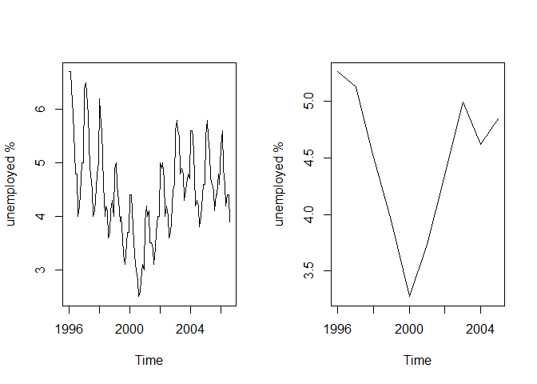

# time_series
gasiino  
1 December 2016  


```r
library(reshape2)
library(ggplot2)
# Multiple plot function
#
# ggplot objects can be passed in ..., or to plotlist (as a list of ggplot objects)
# - cols:   Number of columns in layout
# - layout: A matrix specifying the layout. If present, 'cols' is ignored.
#
# If the layout is something like matrix(c(1,2,3,3), nrow=2, byrow=TRUE),
# then plot 1 will go in the upper left, 2 will go in the upper right, and
# 3 will go all the way across the bottom.
#
multiplot <- function(..., plotlist=NULL, file, cols=1, layout=NULL) {
  library(grid)
  
  # Make a list from the ... arguments and plotlist
  plots <- c(list(...), plotlist)
  
  numPlots = length(plots)
  
  # If layout is NULL, then use 'cols' to determine layout
  if (is.null(layout)) {
    # Make the panel
    # ncol: Number of columns of plots
    # nrow: Number of rows needed, calculated from # of cols
    layout <- matrix(seq(1, cols * ceiling(numPlots/cols)),
                     ncol = cols, nrow = ceiling(numPlots/cols))
  }
  
  if (numPlots==1) {
    print(plots[[1]])
    
  } else {
    # Set up the page
    grid.newpage()
    pushViewport(viewport(layout = grid.layout(nrow(layout), ncol(layout))))
    
    # Make each plot, in the correct location
    for (i in 1:numPlots) {
      # Get the i,j matrix positions of the regions that contain this subplot
      matchidx <- as.data.frame(which(layout == i, arr.ind = TRUE))
      
      print(plots[[i]], vp = viewport(layout.pos.row = matchidx$row,
                                      layout.pos.col = matchidx$col))
    }
  }
}

## function to create a data.frame from a timeseries object giving it the column time
getplottable <- function(tsObject){
  tsTimes <- seq(attr(tsObject,"tsp")[1], attr(tsObject,"tsp")[2], by=1/attr(tsObject,"tsp")[3])
  tsDF <- data.frame(x=tsObject, time=tsTimes)
  tsDF
}
```


```r
data("AirPassengers")
AP <- AirPassengers
AP
```

```
##      Jan Feb Mar Apr May Jun Jul Aug Sep Oct Nov Dec
## 1949 112 118 132 129 121 135 148 148 136 119 104 118
## 1950 115 126 141 135 125 149 170 170 158 133 114 140
## 1951 145 150 178 163 172 178 199 199 184 162 146 166
## 1952 171 180 193 181 183 218 230 242 209 191 172 194
## 1953 196 196 236 235 229 243 264 272 237 211 180 201
## 1954 204 188 235 227 234 264 302 293 259 229 203 229
## 1955 242 233 267 269 270 315 364 347 312 274 237 278
## 1956 284 277 317 313 318 374 413 405 355 306 271 306
## 1957 315 301 356 348 355 422 465 467 404 347 305 336
## 1958 340 318 362 348 363 435 491 505 404 359 310 337
## 1959 360 342 406 396 420 472 548 559 463 407 362 405
## 1960 417 391 419 461 472 535 622 606 508 461 390 432
```

```r
class(AP)
```

```
## [1] "ts"
```

```r
start(AP)
```

```
## [1] 1949    1
```

```r
end(AP)
```

```
## [1] 1960   12
```

```r
frequency(AP)
```

```
## [1] 12
```

```r
plot(AP,ylab="Passengers (1000s)")
```

<!-- -->

```r
qplot(AP) + scale_x_continuous()
```

```
## `stat_bin()` using `bins = 30`. Pick better value with `binwidth`.
```

<!-- -->

```r
str(AP)
```

```
##  Time-Series [1:144] from 1949 to 1961: 112 118 132 129 121 135 148 148 136 119 ...
```

```r
rownames(AP)
```

```
## NULL
```

```r
summary(AP)
```

```
##    Min. 1st Qu.  Median    Mean 3rd Qu.    Max. 
##   104.0   180.0   265.5   280.3   360.5   622.0
```

```r
AP
```

```
##      Jan Feb Mar Apr May Jun Jul Aug Sep Oct Nov Dec
## 1949 112 118 132 129 121 135 148 148 136 119 104 118
## 1950 115 126 141 135 125 149 170 170 158 133 114 140
## 1951 145 150 178 163 172 178 199 199 184 162 146 166
## 1952 171 180 193 181 183 218 230 242 209 191 172 194
## 1953 196 196 236 235 229 243 264 272 237 211 180 201
## 1954 204 188 235 227 234 264 302 293 259 229 203 229
## 1955 242 233 267 269 270 315 364 347 312 274 237 278
## 1956 284 277 317 313 318 374 413 405 355 306 271 306
## 1957 315 301 356 348 355 422 465 467 404 347 305 336
## 1958 340 318 362 348 363 435 491 505 404 359 310 337
## 1959 360 342 406 396 420 472 548 559 463 407 362 405
## 1960 417 391 419 461 472 535 622 606 508 461 390 432
```

```r
# APtime <-attr(AP,"tsp")
# APtimes <- seq(APtime[1], APtime[2], by=1/APtime[3])
# APdf <- data.frame(x=AP, time=APtimes)

ggplot(data=getplottable(AP), aes(time, x)) +
  geom_line() + scale_y_continuous() #+ scale_continuous()  #+
```

<!-- -->

```r
  #?scale_x_continuous(xlab) +
  #scale_y_continuous(ylab) +
  #ggtitle(title)

# ?attr
# attributes(AP)
aggregate(AP)
```

```
## Time Series:
## Start = 1949 
## End = 1960 
## Frequency = 1 
##  [1] 1520 1676 2042 2364 2700 2867 3408 3939 4421 4572 5140 5714
```

```r
layout(1:2)
plot(aggregate(AP))
boxplot(AP ~ cycle(AP))
```

<!-- -->

```r
layout(1:1)

p1<-ggplot(data=getplottable(aggregate(AP)), aes(time, x)) + 
  geom_line() + 
  #scale_x_continuous() + 
  scale_y_continuous() #+ scale_continuous() #+

df <- data.frame(time=getplottable(AP)$time,x=getplottable(AP)$x,y=getplottable(cycle(AP))$x) 
p2<-ggplot(data=df, aes(factor(y),x)) +
  geom_boxplot() + scale_y_continuous() #+ 
  #scale_x_continuous()#+ scale_continuous() #+


multiplot(p1,p2)
```

<!-- -->


```r
www <- "Maine.dat"

Maine.month <- read.table(www, header = TRUE)
attach(Maine.month)
class(Maine.month)
```

```
## [1] "data.frame"
```

```r
Maine.month.ts <- ts(Maine.month,start=c(1996,1),freq=12)
Maine.year.ts <- aggregate(Maine.month.ts)/12

layout(matrix(c(1,2),nrow=1,ncol=2))
plot(Maine.month.ts, ylab="unemployed %")
plot(Maine.year.ts, ylab="unemployed %")
```

<!-- -->

```r
layout(1:1)
p1<-ggplot(data=getplottable(Maine.month.ts), aes(time, unemploy)) + geom_line() + ggtitle("Maine.month.ts") + ylab("unemployed %")
p2<-ggplot(data=getplottable(Maine.year.ts), aes(time, unemploy)) + geom_line() + ggtitle("Maine.year.ts") + ylab("unemployed %")

multiplot(p1,p2,cols=2)
```

<!-- -->

```r
Maine.Feb <- window(Maine.month.ts,start=c(1996,2),freq=TRUE)
Maine.Aug <- window(Maine.month.ts,start=c(1996,8),freq=TRUE)
Feb.ratio <- mean(Maine.Feb) / mean(Maine.month.ts)
Aug.ratio <- mean(Maine.Aug) / mean(Maine.month.ts)

Feb.ratio
```

```
## [1] 1.222529
```

```r
Aug.ratio
```

```
## [1] 0.8163732
```

```r
www <- "USunemp.dat"
US.month <- read.table(www,header = TRUE)
attach(US.month)
US.month.ts <- ts(US.month,start=c(1996,1),end=c(2006,10),freq=12)

plot(US.month.ts, ylab="unemployed %")
```

<!-- -->

```r
ggplot(data=getplottable(US.month.ts), aes(time, USun)) + geom_line() + ggtitle("US.month.ts") + ylab("unemployed %")
```

<!-- -->


```r
www <- "cbe.dat"

CBE <- read.table(www, header = TRUE)
CBE[1:4,]
```

```
##   choc beer elec
## 1 1451 96.3 1497
## 2 2037 84.4 1463
## 3 2477 91.2 1648
## 4 2785 81.9 1595
```

```r
class(CBE)
```

```
## [1] "data.frame"
```

```r
Elec.ts <- ts(CBE[,3],start=1958,freq=12)
Beer.ts <- ts(CBE[,2],start=1958,freq=12)
Choc.ts <- ts(CBE[,1],start=1958,freq=12)

plot(cbind(Elec.ts,Beer.ts,Choc.ts))
```

<!-- -->

```r
p1<-ggplot(data=getplottable(Elec.ts), aes(time, x)) + geom_line() + ggtitle("Elec.ts") + scale_y_continuous()
p2<-ggplot(data=getplottable(Beer.ts), aes(time, x)) + geom_line() + ggtitle("Beer.ts") + scale_y_continuous()
p3<-ggplot(data=getplottable(Choc.ts), aes(time, x)) + geom_line() + ggtitle("Choc.ts") + scale_y_continuous()

multiplot(p1,p2,p3,cols=1)
```

<!-- -->

```r
AP.elec <- ts.intersect(AP,Elec.ts)
start(AP.elec)
```

```
## [1] 1958    1
```

```r
end(AP.elec)
```

```
## [1] 1960   12
```

```r
AP.elec[1:3,]
```

```
##       AP Elec.ts
## [1,] 340    1497
## [2,] 318    1463
## [3,] 362    1648
```

```r
AP <- AP.elec[,1]
Elec <- AP.elec[,2]

layout(1:2)
plot(AP,main="",ylab="Air passengers (1000)")
plot(Elec,main="",ylab="Electricity production (MWh)")
```

<!-- -->

```r
layout(1:1)

p1<-ggplot(data=getplottable(AP), aes(time, x)) + geom_line() + ggtitle("AP") + ylab("Air passengers (1000)") + scale_y_continuous()
p2<-ggplot(data=getplottable(Elec), aes(time, x)) + geom_line() + ggtitle("Elec") + ylab("Electricity production (MWh)") + scale_y_continuous()

multiplot(p1,p2,cols=1)
```

<!-- -->

```r
plot(as.vector(AP),as.vector(Elec),xlab="Air passengers (1000)",ylab="Electricity production (MWh)")
abline(reg=lm(Elec~AP))
```

<!-- -->

```r
df <- merge(getplottable(AP),getplottable(Elec),by="time")
names(df) <- c("time","ap","elec")
ggplot(data=df,aes(ap,elec)) +geom_point() +stat_smooth(method = "lm", col = "red") + xlab("Air passengers (1000)") + ylab("Electricity production (MWh)")
```

<!-- -->


